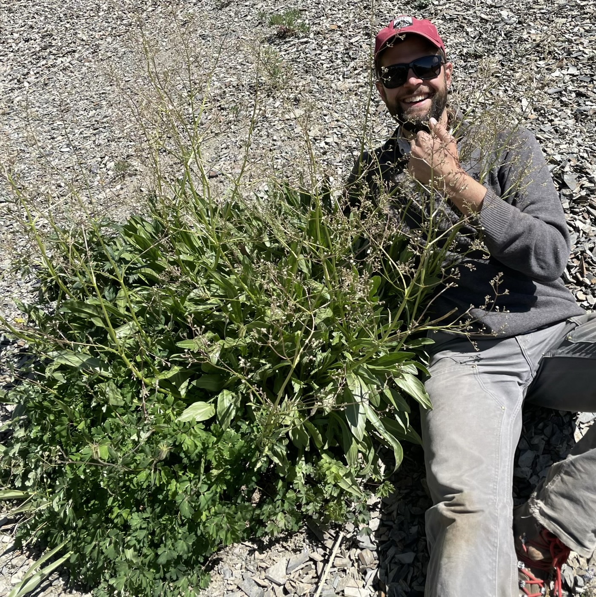
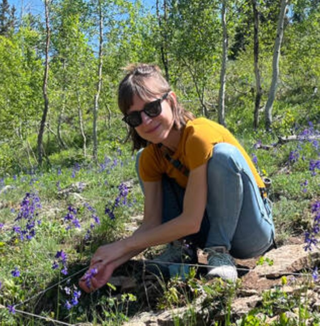
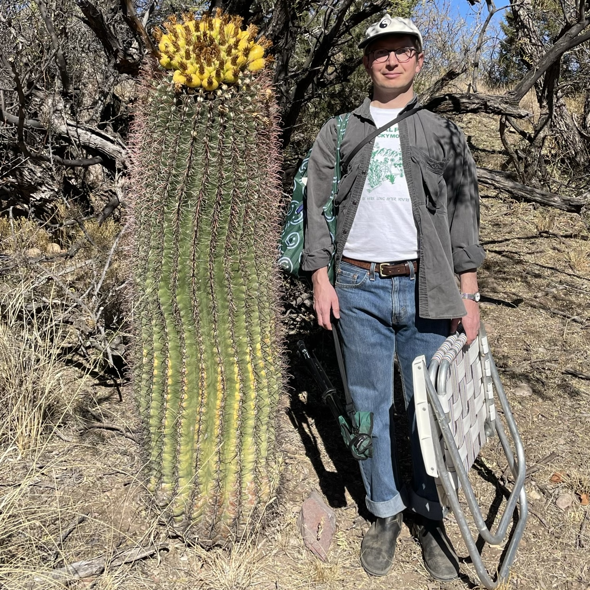

Participants in this workshop will learn how to build, parameterize, and analyze Integral Projection Models (IPM) for studying population dynamics. This course will be taught at the Rocky Mountain Biological Laboratory in Gothic, Colorado, from **August 10–12, 2026**. The course will emphasize decision making across the entire workflow, from census design (outdoor field excursions to local demographic studies) through model construction and projection (indoor lectures and exercises).

## Instructors

{width="2in"} [Will Petry](https://parameterizeit.github.io/), North Carolina State University

{width="2in"} [Amy Iler](https://amymarieiler.weebly.com/), Chicago Botanic Garden & Northwestern University

{width="2in"} [Paul CaraDonna](https://paulcaradonna.weebly.com/), Chicago Botanic Garden & Northwestern University

## Workshop description

Integral projection models (IPMs) enable the study of population dynamics in organisms with complex population structure and are widely used to answer ecological and evolutionary questions. Like matrix population models, IPMs break the life cycle down into intuitive, biologically meaningful rates of growth, survival, reproduction, and recruitment. Unlike matrix models, IPMs allow the state variable(s) that predict the demographic rates that compose the life cycle to be continuous (e.g., size, weight) or a combination of continuous and discrete variables (e.g., age, stage). The demographic vital rates that compose the life cycle are estimated using a series of regression analyses (*e.g*., linear models, LMMs, GLMMs).

This workshop will guide participants through the process of demographic census design and the construction and analysis of IPMs. The RMBL field station will enable outdoor, field-based discussions of how to tailor IPMs to the life cycle of the study organism and strategies to overcome common data collection pitfalls. Indoors, these lessons will be used to guide model construction choices, culminating in the construction and analysis of an IPM in R using the package [`ipmr`](https://padrinodb.github.io/ipmr/). This course will provide an introduction to stage structured population modeling, instruction on how to build IPMs, and what you can do with IPMs once they are constructed (*e.g.,* estimate population growth rate, calculate sensitivities and elasticities, and calculate stage-specific survival and reproduction).

If time permits, we will also cover advanced topics selected based on a pre-course survey of the participants. Potential advanced topics include: propagating uncertainty, density- and frequency-dependence, incorporating environmentally-driven vital rates, or multiple state variables.

{fig-align="center" width="3in"}
